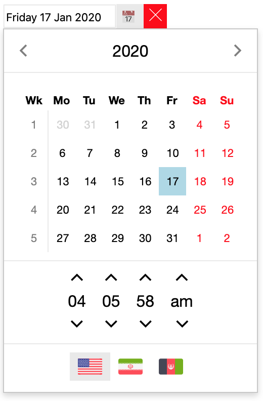
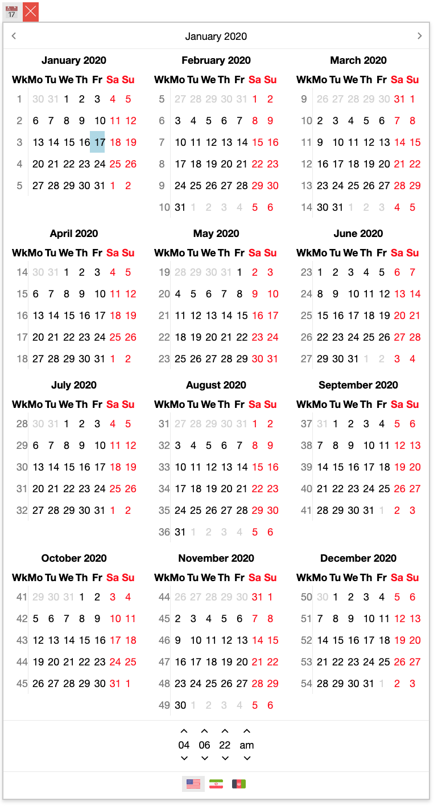
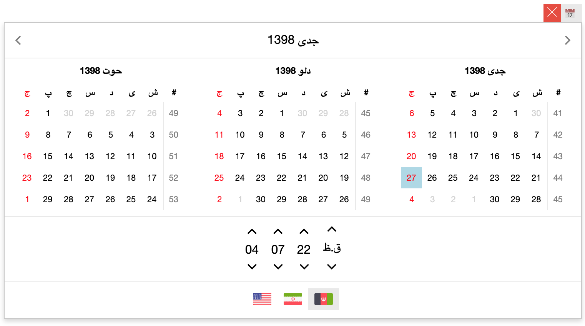
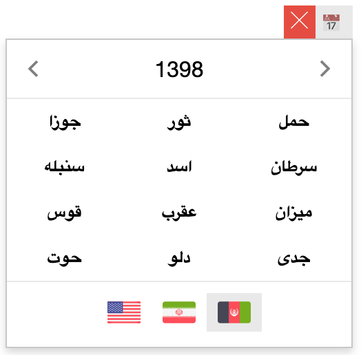
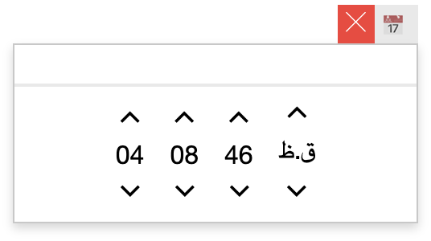

# ni-datetime-picker

Angular8 month|date|time picker with Persian (Afghanistan, and Iran), and Gregorian calendar support.

## Installation

    npm i ni-datetime-picker

## Demo

Stackblitz Demo: https://angular-ni-datetime-picker.stackblitz.io

Stackblitz play ground: https://stackblitz.com/edit/angular-ni-datetime-picker

## Screenshots







## Import the NiDatetimePickerModule

```typescript
// import module
import { NiDatetimePickerModule } from "ni-datetime-picker";

@NgModule({
  declarations: [AppComponent],
  imports: [
    BrowserModule,
    // register module
    NiDatetimePickerModule
  ],
  providers: [],
  bootstrap: [AppComponent]
})
export class AppModule {}
```

## Example

Following example shows all the options avaiable in the component:

- your.component.ts

```typescript
export class YourComponent implements OnInit {
  value = new Date();
  defaultDate = new Date();
  monthPicker = false;
  datePicker = true;
  timePicker = false;
  inline = false;
  showLocaleSwitch = true;
  locale = "fa_AF";
  inputFormat = "YYYY-MM-DD";
  placeholder = "date/time";
  titleFormat = "";
  monthHeaderFormat = "MMMM";
  numberOfMonths = 1;
  disabledDates = [];
  disabledDatesStr = "2020-01-02 00:00:00,2020-01-03 00:00:00";
  disableWeekends = false;
  showWeekNums = false;
  selectionMode = "range";
  selectedSeparator = ", ";
  showPickerIcon = true;
  showTodayBtn = true;
  todayBtnText = "";
  showClearBtn = true;
  clearBtnText = "";
  todayBtnSet = "andValue";
  showYearNavigator = true;
  yearNavigatorRange = "1370,1410";
  showMonthNavigator = true;

  customLocale: NiDatetimeLocale = {
    name: "Custom",
    new: () => new NiJalaliDatetime(),
    week: "js",
    dir: "ltr",
    firstday: 5,
    weekends: [0, 3, 5],
    daysName: [
      "Sun__",
      "Mon__",
      "Tues__",
      "Weds__",
      "Thurs__",
      "Fri__",
      "Satur__"
    ],
    daysNameShort: ["Sun", "Mon", "Tue", "Wed", "Thu", "Fri", "Sat"],
    daysNameMini: ["Su", "Mo", "Tu", "We", "Th", "Fr", "Sa"],
    monthsName: [
      "January",
      "February",
      "March",
      "April",
      "May",
      "June",
      "d",
      "August",
      "September",
      "October",
      "November",
      "December"
    ],
    monthsNameShort: [
      "Jan",
      "Feb",
      "Mar",
      "Apr",
      "May",
      "Jun",
      "Jul",
      "Aug",
      "Sep",
      "Oct",
      "Nov",
      "Dec"
    ],
    ampm: ["**", "__"],
    AMPM: [":)", ":("],
    today: "امروز",
    clear: "پاک"
  };

  // ...
}
```

- your.component.html

```html
<ni-datetime-picker
  [appendTo]="parent"
  [(value)]="value"
  [selectionMode]="selectionMode"
  [selectedSeparator]="selectedSeparator"
  [disabledDates]="disabledDates"
  [disableWeekends]="disableWeekends"
  [showWeekNums]="showWeekNums"
  [showPickerIcon]="showPickerIcon"
  [showTodayBtn]="showTodayBtn"
  [todayBtnText]="todayBtnText"
  [showClearBtn]="showClearBtn"
  [clearBtnText]="clearBtnText"
  [todayBtnSet]="todayBtnSet"
  [defaultDate]="defaultDate"
  [monthPicker]="monthPicker"
  [datePicker]="datePicker"
  [timePicker]="timePicker"
  [inline]="inline"
  [locales]="localesString"
  [showLocaleSwitch]="showLocaleSwitch"
  [locale]="locale"
  [monthDateLocales]="['en_US', 'ar_SA']"
  [inputFormat]="inputFormat"
  [placeholder]="placeholder"
  [titleFormat]="titleFormat"
  [monthHeaderFormat]="monthHeaderFormat"
  [numberOfMonths]="numberOfMonths"
  [showYearNavigator]="showYearNavigator"
  [yearNavigatorRange]="yearNavigatorRange"
  [showMonthNavigator]="showMonthNavigator"
  (showed)="event($event, 'showed')"
  (hidded)="event($event, 'hidded')"
  (focused)="event($event, 'focused')"
  (blurred)="event($event, 'blurred')"
  (valueChanged)="event($event, 'valueChanged')"
  (viewUpdated)="event($event, 'viewUpdated')"
  (localeChanged)="event($event, 'localeChanged')"
  [monthDateTemplate]="template"
>
  <ng-template #template let-date>
    <!-- 
        date: ViewMonth;
        also contains date.xx_xx is monthDateLocales Ymd
        -->
  </ng-template>
</ni-datetime-picker>
```

## Options:

- **[(value)]**: a date|date[] specifies the selected value(s). the value will be a single date if selectionMode is 'single', an array if selectionModel is 'multiple', and an array of 1 (start) or 2 (start and end) dates will be emitted for 'range' selectionMode.
- **[defaultDate]**: value to be used when 'value' is null to prepare the datepicker view. current time will be used by default.
- **[(locale)]**: by default 'fa_AF'. availables are: fa_AF, fa_IR, en_US. provide a NiDatetimeLocale for custom locale.
- **[showLocaleSwitch]**: show/hide the locale switcher. note: your custom calendarLocale will be ignored during in switching.
- **[locales]**: a list of locale name (string) which will be used in LocaleSwitch section. eg: ['fa_AF', 'en_US']
- **[inputFormat]**: datepicker input format. check the formatting for more information.
- **[placeholder]**: datepicker input placeholder.
- **[titleFormat]**: datepicker dialog title format. check the formatting for more information.
- **[numberOfMonths]**: ranging from [1-12] specifies the number of visible month in datepicker view
- **[monthHeaderFormat]**: if numberOfMonths > 1, this specifies the format for each month header. check the formatting for m re information.
- **[monthPicker]**: is a month picker
- **[datePicker]**: is a date picker. it is overrided if monthPicker is true.
- **[timePicker]**: is a time picker.
- **[inline]**: is inline
- **[disableWeekends]**: weekends should be disabled
- **[disabledDates]**: an array of Date object specifying the disabled dates
- **[showWeekNums]**: show the week nums
- **[selectionMode]**: a string specifying the selection mode. 'single' by default. possible values: 'single', 'multiple', 'range'.
- **[selectedSeparator]**: a string specifying selected values separator. by default ', ' is used for 'multiple' and ' - ' is used for range selection.
- **[showPickerIcon]**: show the picker icon. by default false.
- **[showTodayBtn]**: show today button. by default false.
- **[todayBtnText]**: today btutton text. by default uses NiDatetimeLocale.\_\_\_.today.
- **[showClearBtn]**: show clear button. by default false.
- **[clearBtnText]**: clean button text. by default uses NiDatetimeLocale.\_\_\_.clear.
- **[todayBtnSet]**: whether the today button update 'onlyView', or view 'andValue'. 'andValue'by default. possible values: 'onlyView', 'andValue', ''.
- **[showYearNavigator]**: show year navigator, by default false.
- **[yearNavigatorRange]**: year navigator range 'start,end', or 'year1,year2,year3...'. by default ''.
- **[showMonthNavigator]**: show month navigator, by default false.
- **[monthDateLocales]**: a list of locale name that should be pass while rendering month date. eg: ['en_US', 'ar_SA']
- **[monthDateTemplate]**: specifies the ng-template reference to be used for rendering month date.
  ```html
  <ng-template #template let-date>
    <!-- 
    date: ViewMonth;
    date also contains Ymd value for spcifies monthDateLocales
    -->
  </ng-template>
  ```
- **[appendTo]**: specifies the element to attach the view month modal to that.

- **(showed)**: trigger when a show event is happened. {} is passed as the emit value.
- **(hidded)**: trigger when a hide event is happened. {} is passed as the emit value.
- **(focused)**: trigger when a Focus event is happened. {} is passed as the emit value.
- **(blurred)**: trigger when a Blur event is happened. {} is passed as the emit value.
- **(valueChanged)**: trigger when value is change. ValueChange|ValueChange[] will be emitted.
  ```typescript
  export interface ValueChange {
    date?: Date;
    viewDate?: ViewDate; // locale specific values
    viewDateFormatted?: string; // formatted as inputFormat
  }
  ```
- **(viewUpdated)**: trigger when a view update event is happened.
  ```typescript
  interface ViewUpdateEvent {
    viewMinDate: Date; // smallest visible (except previous month's date) date in the view
    viewMaxDate: Date; // biggest visible (except next month's date) date in the view
  }
  ```
- **(localeChanged)**: trigger when a locale change event is happened.
  ```typescript
  interface LocaleChangeEvent {
    previous: string; // fa_AF|fa_IR|en_US;
    locale: string; // fa_AF|fa_IR|en_US;
  }
  ```

## Formats

- `'YYYY', 4 digit year`
- `'YY', 2 digit year`
- `'MMMM', long name of month`
- `'MMM', short name of month`
- `'MM', 2 digit month number`
- `'M', month number`
- `'DD', 2 digit date number`
- `'D', date number`
- `'WWWW', long name of week's day`
- `'WWW', short name of week's day`
- `'WW', mini name of week's day`
- `'HH', 2 digit hour (24h format)`
- `'hh', 2 digit hour (12h format)`
- `'H', hour (24h format)`
- `'h', hour (12h format)`
- `'mm', 2 digit minute`
- `'m', minute`
- `'ss', 2 digit second`
- `'s', second`
- `'A', upper case AM/PM`
- `'a', lower case am/pm`
- `'z', time zone (eg: GMT-0500)`
- `'iso', iso format (eg: 2020-01-17T08:57:58.144Z)`
- `'mediumDate': 'WWW DD MMM, YYYY'`
- `'mediumTime': 'hh:mm a'`
- `'shortDate': 'YY/M/D'`
- `'shortTime': 'h:m a'`
- `'longDate': 'WWWW DD MMMM YYYY'`
- `'longTime': 'hh:mm:ss A'`
- `'medium': 'mediumDate mediumTime'`
- `'short': 'shortDate shortTime'`
- `'long': 'longDate longTime'`

## Credits:

- Uses [Jalali JavaScript](https://github.com/jalaali/jalaali-js) for Jalali conversion.
